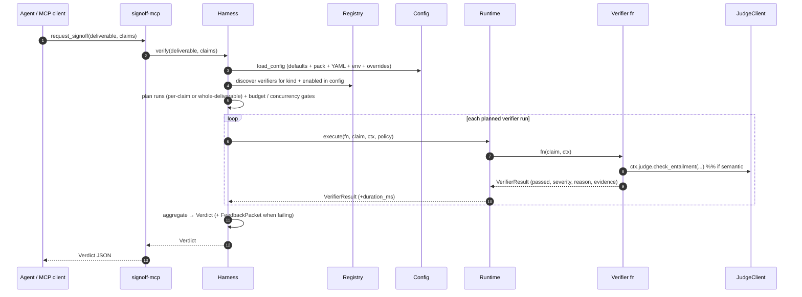

# Architecture

This doc is for the reader who has seen the [quickstart](./quickstart.md)
and wants to know how the pieces fit before committing to Signoff
for anything serious. It's descriptive, not normative — the
authoritative specification is [`protocol.md`](./protocol.md).

---

## The four primitives

Everything in Signoff composes four concepts. They correspond to
the four non-transport sections of the protocol spec.

**Deliverable.** What the agent submitted. Has an `id`, a `kind`
(e.g. `"code_change"`, `"research_report"`), opaque `content`, and
`metadata`. Packs that understand a particular `kind` define the
shape of `content` — e.g. `signoff-code` defines
`CodeChangeDeliverable` for `kind="code_change"`. Everything else
sees `content` as opaque JSON that round-trips through
`request_signoff`.

**Claim.** An asserted fact, citation, computation, or policy
statement embedded in (or derived from) a deliverable. A
research-report deliverable carries many claims (each citation is
one); a code-change deliverable usually carries zero and is
verified "whole" via `claim_kinds="*"` verifiers.

**Verifier.** A pluggable `async` function that checks claims or
whole deliverables and returns a `VerifierResult`. Each verifier
declares metadata (name, pack, `claim_kinds`, `cost_tier`,
`concurrency`, `runtime_required`) via a `@verifier(...)` decorator
and gets discovered via a Python entry point.

**Pack.** A pip-installable bundle of verifiers, prompts, and
default config for a domain. `signoff-code` is a pack.
`signoff-research` (forthcoming) will be a pack. Teams that need
domain-specific checks ship their own packs rather than monkey-
patching the core.

---

## The Harness lifecycle

The harness is one short pipeline that runs per `verify()` call:



Each stage is a thin layer:

- **Resolution** (`signoff.config.load_config` + `signoff.harness._plan_runs`):
  which verifiers, which claims, with what policy overrides.
- **Scheduling**: a global `asyncio.Semaphore` (`budget.global_concurrency`)
  plus per-verifier concurrency caps, per-run wall-clock timeouts,
  and an optional `sample_rate` that probabilistically skips runs
  for flaky / expensive verifiers.
- **Execution**: routed through a `Runtime`. The runtime decides
  where the Python coroutine runs and (for `DockerRuntime`) where
  its `ctx.exec` subprocess calls land.
- **Aggregation**: every result contributes to the final `Verdict`;
  blocker-severity failures populate the `FeedbackPacket` designed
  for the agent to read and retry against.

---

## The Runtime abstraction

A `Runtime` is the abstraction for *where and how* a verifier
executes. The harness calls `runtime.execute(fn, claim, ctx, policy)`;
the runtime decides:

- Does the verifier's Python run in-process or in a sandbox?
- What are the resource / network / filesystem limits?
- What does `ctx.exec(["pytest", ...])` actually do — call
  `asyncio.create_subprocess_exec` on the host, or bind-mount the
  workspace into a container and route through `docker exec`?

Separating "what to check" from "where and how it runs" is what
lets `signoff-code`'s verifiers work identically in local dev and
in a sandboxed CI pipeline. The verifier code doesn't change; the
runtime does.

```
                       Runtime protocol
                     ┌──────────────────┐
                     │  prepare(meta)   │
                     │  execute(fn, …)  │
                     │  teardown()      │
                     └────────┬─────────┘
                              │ satisfied by
      ┌───────────────────────┼──────────────────────────────┐
      │                       │                              │
┌─────▼─────┐       ┌─────────▼─────────┐         ┌──────────▼──────────┐
│ LocalRun- │       │ DockerRun-        │         │  Future: Firecracker│
│  time     │       │  time             │         │  / Wasm / K8s Jobs  │
│ (in-proc) │       │ (sandbox per run) │         │                     │
└───────────┘       └───────────────────┘         └─────────────────────┘
```

**`LocalRuntime`** ships in `signoff-core`. Zero dependencies. Runs
verifiers in the harness process, enforces `policy.timeout_seconds`
via `asyncio.wait_for`, and emits a WARNING when it receives a
`RuntimePolicy` asking for enforcement it can't provide (CPU caps,
network isolation, etc.). Right for trusted contexts: unit tests,
single-user development, controlled CI on your own code.

**`DockerRuntime`** ships in `signoff-runtime-docker`. Spawns an
ephemeral container per verifier invocation with:

- `cap_drop=[ALL]`, `cap_add=[]`, `security_opt=["no-new-privileges"]`.
- `read_only=True` rootfs; tmpfs at `/tmp`; workspace bind-mounted
  read-only by default.
- Non-root user (UID 10001).
- `network_mode="none"` by default; `RuntimePolicy.network="allowlist"`
  is a Phase-1 placeholder that downgrades to `bridge` with a
  one-shot WARNING (DNS-filter work tracked separately).
- PID / memory / CPU caps from `RuntimePolicy`.
- cosign signature verification on the image before first use.

The verifier's *Python body* still runs in the harness process;
what's sandboxed is the subprocess invocations it makes via
`ctx.exec`. That's the attack surface (untrusted commands), not the
pack author's code. Full posture: [`runtimes.md`](./runtimes.md) §
DockerRuntime.

**Future runtimes** (Firecracker, Wasm, Kubernetes Jobs) plug in
by satisfying the same protocol. Each lives in its own package so
a user who doesn't need Firecracker doesn't inherit its build
dependencies.

---

## The three surfaces

Signoff ships along three axes.

**Library (Python).** `pip install signoff-core`. Embed in any
agent loop:

```python
async with await Harness.from_config_path("signoff.yaml") as h:
    verdict = await h.verify(deliverable, claims)
```

No MCP server, no transport, just the harness as a library. This
is the surface that protocol conformance is measured against — if
it works as a library, the MCP server and hosted service are just
wrappers.

**MCP server.** `pip install signoff-mcp; signoff-mcp --transport
http`. Exposes the harness as the three MCP tools listed in
[`protocol.md`](./protocol.md) §7.3:

- `request_signoff(deliverable, claims) → Verdict`
- `list_verifiers() → [VerifierMeta]`
- `get_verdict(id) → Verdict` (hosted-only; local no-op)

The protocol surface is frozen at 0.1; additions are additive.

**Hosted service** (Phase 2). A managed cloud that handles
request_signoff at scale, persists verdicts in a tamper-evident
audit log, enforces per-team budgets, and optionally hands clients
TypeScript bindings via `@signoff/sdk`. Live after the Phase 1
verifier packs are shipping. Not the subject of this PR.

---

## The wire format

`Deliverable`, `Claim`, `VerifierResult`, `FeedbackPacket`, and
`Verdict` are the protocol's wire format. They're defined with
Pydantic v2 in `signoff.models` and exported as JSON Schemas from
`packages/signoff-core/src/signoff/schemas/`. The TypeScript SDK
validates against those same schemas via `zod`.

Two in-process types deliberately are NOT wire format:
`FetchResult` (returned by `ctx.http.get/head`) and `JudgeResult`
(returned by `ctx.judge.check_entailment`). They're consumed by
verifier code and never cross the request_signoff boundary.

For the exact field list of each wire type, see
[`protocol.md`](./protocol.md) §3. For cross-language parity tests
that pin the TS and Python implementations to the same JSON shape,
see `tests/parity/`.

---

## Extension points

Writing your own verifier: three things.

1. **A decorated `async def`.**

   ```python
   from signoff import verifier, Claim, VerifierContext, VerifierResult

   @verifier(
       name="my_check",
       claim_kinds=["citation"],
       cost_tier="cheap",
       concurrency=10,
       runtime_required="local",
   )
   async def my_check(claim: Claim, ctx: VerifierContext) -> VerifierResult:
       r = await ctx.http.head(claim.evidence["url"])
       if r.status_code >= 400:
           return ctx.fail(
               reason=f"Source returned HTTP {r.status_code}",
               suggestion="Replace the source URL or remove the claim.",
               evidence={"url": claim.evidence["url"], "status": r.status_code},
           )
       return ctx.ok(evidence={"status": r.status_code})
   ```

2. **An entry point in your pack's `pyproject.toml`:**

   ```toml
   [project.entry-points."signoff.verifiers"]
   my_check = "my_pack.verifiers.my_check:my_check"
   ```

3. **Optionally, a pack default config** via the
   `signoff.pack_defaults` entry point group. `load_config` merges
   these in layer 2 (between built-in defaults and user YAML).

`Registry.discovered()` walks entry points on import; the harness
finds your verifier without any manual registration. Full walk-
through: [`writing-a-verifier.md`](./writing-a-verifier.md) and
[`writing-a-pack.md`](./writing-a-pack.md).

---

## What the audit trail looks like

Every `VerifierResult.evidence` is a free-form dict the verifier
author populates. Conventions used by shipped verifiers:

- `runtime`: `"docker"` or `"local"`.
- `container_id`: first 12 chars of the Docker container, when
  applicable. Ties a verdict back to a specific sandbox run.
- `image`: e.g. `"ghcr.io/signoff/code-sandbox:latest"`. Ties back
  to a signed, scanned artifact.
- `model` + `prompt_version`: for judge-backed verifiers. Diffing
  two verdicts across a prompt bump isolates prompt effects from
  model effects.
- `retries`: list of `{attempt, reason, backoff_ms}` for HTTP or
  judge calls that hit transient failures.
- `usage.{input,output}_tokens`: for judge calls. Feeds
  `verdict.cost_usd`.

These fields aren't schema-enforced — they're conventions the
shipped verifiers follow so operators reading a verdict JSON know
where to look. The protocol leaves `evidence` open so packs can
add domain-specific fields without a schema change.

---

## Current limitations

Honest list, not a roadmap.

- **Python-only verifier packs.** TypeScript (or any other
  language) pack is a follow-up — the runtime abstraction doesn't
  care, but nobody's shipped one yet.
- **BaseReference.git_sha and .tarball_url are placeholders.**
  `signoff-code`'s `CodeChangeDeliverable` supports `local_path`
  today; the two remote-fetch kinds raise a clear
  `WorkspaceError`. The `tarball_url` gap is the missing bytes API
  on `HttpClient`; `git_sha` needs a repo-URL field in
  `BaseReference`.
- **`RuntimePolicy.network="allowlist"` downgrades to `"bridge"`.**
  DNS-filtering work is tracked separately.
- **No coverage verifier.** Interesting but explicitly out of
  scope for the first pack.
- **No Wasm / Firecracker runtimes.** The protocol supports them;
  no package has implemented one yet.
- **Hosted service is Phase 2.** Every code path that assumes a
  hosted backend is currently either a placeholder or
  documentation.

When any of these changes, this list shortens in-tree.

---

## See also

- [`protocol.md`](./protocol.md) — the normative spec.
- [`runtimes.md`](./runtimes.md) — Runtime protocol + DockerRuntime
  deep-dive.
- [`configuration.md`](./configuration.md) — YAML schema +
  `SIGNOFF_*` env-var namespace table.
- [`packs/signoff-code.md`](./packs/signoff-code.md) — the first
  shipped pack, in detail.
