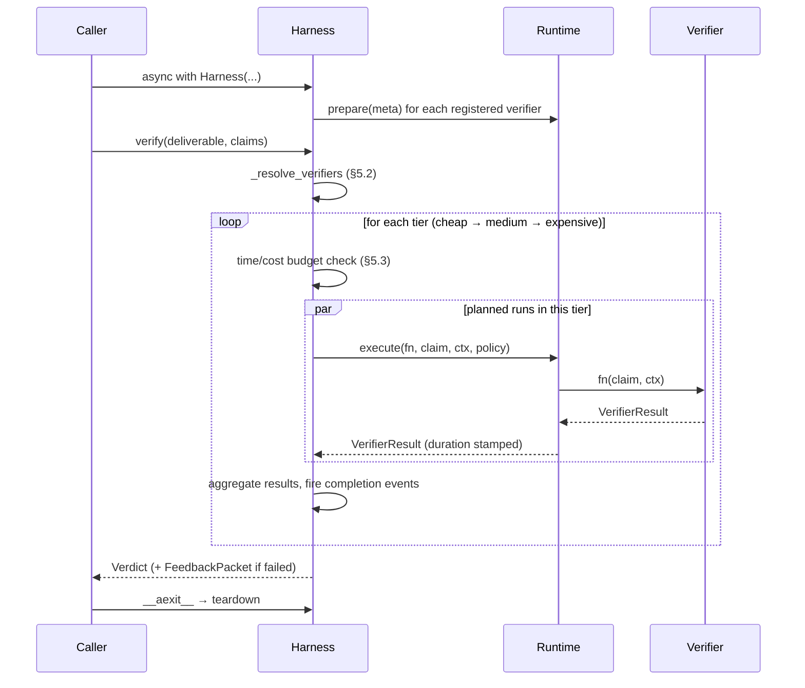

# The Harness

The harness is Signoff's orchestrator. It takes a `Deliverable` and its `Claim`s, resolves which verifiers should run, schedules them under concurrency and budget constraints, collects the results, builds a `Verdict` (and a `FeedbackPacket` for failed ones), and returns.

Normative contract: [`docs/protocol.md`](./protocol.md) §5. Source: [`signoff.harness`](../packages/signoff-core/src/signoff/harness.py).

---

## Demo

```python
from signoff import Claim, Deliverable, Harness, LocalRuntime, Registry, load_config
from signoff.testing import FakeHttpClient, FakeJudge

registry = Registry()
registry.discover()                             # finds installed packs

config = load_config(path="examples/minimal.yaml")

deliverable = Deliverable(id="dlv_1", kind="research_report", content={"body": "..."})
claims = [Claim(id="clm_1", text="…", kind="citation", evidence={"url": "…"})]

async with Harness(
    config=config,
    registry=registry,
    runtimes={"local": LocalRuntime()},
    http=FakeHttpClient(),                      # real HttpClient arrives later
    judge=FakeJudge(),
) as h:
    verdict = await h.verify(deliverable, claims)
    print(verdict.model_dump_json(indent=2))
```

The convenience `Harness.from_config_path("…")` wraps all of the above with sensible defaults.

---

## Lifecycle



---

## Resolution (§5.2)

`_resolve_verifiers` produces a list of `_PlannedVerifierRun` objects. Each planned run is one scheduled invocation of one verifier against one claim (or a whole-deliverable slot). Behavior:

1. Look up `config.deliverables[deliverable.kind]`. If absent, log INFO and return an empty plan — the verdict passes trivially.
2. Compute the active pack set (top-level `packs` unless the deliverable block overrides).
3. For every claim, iterate `registry.for_claim_kind(claim.kind)`:
   - Exclude verifiers whose pack isn't active.
   - Exclude verifiers marked `enabled: false` in config.
   - Apply `sample_rate` via a deterministic `random.Random` (seeded from `SIGNOFF_SAMPLING_SEED` when set).
4. Whole-deliverable (`claim_kinds=["*"]`) verifiers are planned once, with `claim=None`.
5. Resolve runtime: `config.runtime.per_verifier[fqn]` falling back to `config.runtime.default`. Unknown runtime ids fall back to `local` with a WARN log. Verifiers declaring `runtime_required="docker"` against a `LocalRuntime` also log WARN but still run (CLAUDE.md §8.3).
6. Resolve policy: Phase 0 uses `config.runtime_policy.local` across the board; per-runtime typed blocks land with each new runtime package.

---

## Scheduling + budgeting (§5.3)

- **Tier order**: cheap → medium → expensive. Each tier is a complete barrier — no medium planned run starts until every cheap planned run has resolved.
- **Concurrency**: a global semaphore at `config.budget.global_concurrency`, plus a per-verifier semaphore at `meta.concurrency`. Global is acquired first to avoid per-verifier starvation when global is the tighter bound.
- **Dependencies (`requires`)**: each planned run waits on the `asyncio.Event` for its declared dependency FQN. The event fires as soon as all planned runs for that FQN have resolved — so intra-tier dependencies make progress without deadlocking `gather`. If a dependency isn't in the plan at all, the dependent is skipped with `reason="Skipped: dependency X not planned"`. If the dependency produced a BLOCKER, the dependent is skipped with `reason="Skipped: dependency X failed"`.
- **Time budget**: before each tier, the harness checks `perf_counter() - start < max_duration_seconds`. In-flight verifiers are never cancelled by the time budget; queued ones are skipped with an INFO result and `terminated_early=True`.
- **Cost budget**: before the expensive tier, `max_cost_usd - cost_so_far > 0` must hold. Cheap/medium always run — they're declared cheap; the verifier author owns that honesty.

---

## Verdict determination (§5.4)

After every planned run has produced a result (or been skipped):

- `passed` is true iff no result has `passed=false AND severity=blocker`.
- `cost_usd` is the sum of `cost_usd` across all results (§3.6 invariant).
- `duration_ms` is the harness wall-clock, not a sum.
- `terminated_early` is true if cancellation, time-budget exhaustion, or `early_termination` fired.
- `feedback_packet` is non-null when `passed=false`, mapped from blocker/warning results per §3.7. Whole-deliverable entries have `claim_text=None`; per-claim entries echo the original `Claim.text` so the agent can retry without re-fetching.

`Verdict.id` is `vrd_` + 20 Crockford-ish characters (URL-safe, short). `harness_version` is pinned to `signoff.__version__`.

---

## Early termination (§5.5)

When `budget.early_termination=True` and a BLOCKER result lands, `_execute_plan` stops launching new tiers. In-flight work finishes; queued planned runs land as synthetic INFO skips with `reason="Skipped: early termination after blocker"`. `terminated_early` is flipped on the verdict.

The default is `false` so the verdict's audit log is complete even when a blocker surfaces early.

---

## Cancellation (§5.6)

`Harness.cancel()` sets an internal event and calls `.cancel()` on every active verifier task. Tasks receive `CancelledError` while awaiting `runtime.execute(...)`; `LocalRuntime` re-raises unchanged so `_run_one` surfaces the cancel. `_execute_plan` uses `gather(return_exceptions=True)` so partial results are preserved.

`verify()` always returns a `Verdict` — cancellation never raises out. `terminated_early=True` is the caller's signal.

---

## Retry bookkeeping (§5.7)

`verify(..., retry_budget=N)` echoes `N-1` back in `FeedbackPacket.retry_budget_remaining`. The protocol does not dictate whether a failed verdict triggers an agent retry; this field is informational for callers that want to build a retry loop. When `retry_budget` is omitted, `retry_budget_remaining` is `None`.

---

## Invariants the harness enforces on return

- Every result's `verifier` is a fully-qualified `<pack>.<name>` per §4.1 (harness stamps the expected value if the verifier forgot).
- Whole-deliverable results have `claim_id=None` per §3.5.
- A severity upgrade via `severity_override` that would make a result blocker-without-suggestion synthesises a placeholder suggestion so §3.5 holds on the wire.
- Malformed results (those that fail `model_copy` during post-processing) are downgraded to synthetic INFO entries with the original payload in `evidence.original_result` — the verdict never crashes on a misbehaving verifier.

---

## Determinism

Given:
- identical `config`, `registry`, `deliverable`, `claims`;
- `SIGNOFF_SAMPLING_SEED` set to a stable value;
- a fixed `clock` callable;

…two `verify()` calls produce payloads that are byte-identical once `id`, `started_at`, `completed_at`, and `duration_ms` are masked. The integration test [`test_determinism_with_sampling_seed`](../packages/signoff-core/tests/test_harness_integration.py) exercises this.

---

## Things the harness does *not* do (deferred)

- **Real HTTP / LLM-judge clients**: callers inject these. `FakeHttpClient` and `FakeJudge` in `signoff.testing` are the current defaults.
- **Per-verifier RuntimePolicy overrides in config**: schema tolerates it but the harness currently applies `runtime_policy.local` uniformly. Tracking issue to wire this through.
- **DockerRuntime**: `signoff-runtime-docker` (Phase 1, separate package) implements the same `Runtime` protocol and plugs into `harness.runtimes["docker"]`.
- **Persistence / audit log**: verdicts are returned in-memory. The hosted service (`cloud/`) is responsible for storage.
